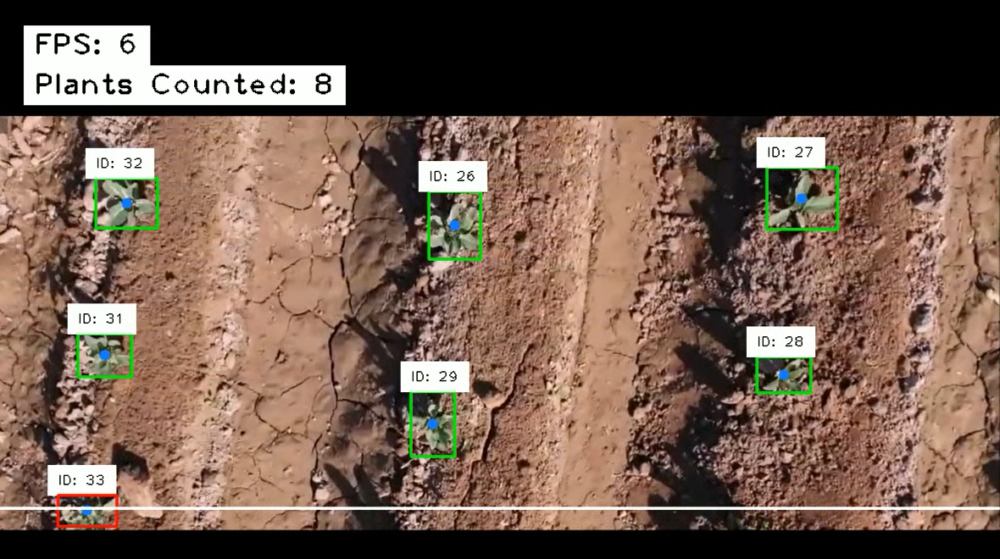

# 🌱 Drone-Based Plant Detection, Tracking & Counting System

🚁 A real-time AI-powered system to detect, track, and count plants from drone-captured agricultural footage using YOLOv8, OpenCV, and a custom object tracker.

---

## 📽️ Demo

  

[Watch the demo on YouTube](https://youtu.be/EjUphagm4K8)

---

## 📌 Problem Statement

Manual plant counting from aerial drone footage is tedious, inaccurate, and unsustainable at scale.  
This system automates plant detection, tracking, and counting using deep learning and computer vision — making **agriculture monitoring smarter and faster**.

---

## ⚙️ Features

✅ Detect plants from drone video using YOLOv8  
✅ Assign unique IDs to each plant using a lightweight centroid tracker  
✅ Count plants crossing a virtual line  
✅ Real-time FPS and plant count overlays  
✅ Save output video with all annotations  
✅ Clean, readable UI with **white overlays**

---

## 🛠️ Tech Stack

- **YOLOv8** – Object detection (Ultralytics)
- **OpenCV** – Image & video processing
- **cvzone** – UI overlays (text, boxes, etc.)
- **Pandas** – Dataframe manipulation
- **Python** – Core implementation
- **Custom Tracker** – Centroid-based multi-object tracker

---

## 🗂️ Directory Structure

```
project/
├── app.py                 # Main script
├── tracker.py             # Object tracking logic
├── model_training/
│   └── best.pt            # YOLOv8 trained weights
├── input_video/
│   └── dronetreecount.mp4 # Sample drone footage
├── output_video.mp4       # Saved output video
├── coco1.txt              # List of class names
├── README.md
```

---

## 🚀 Getting Started

### 1. Clone the Repository
```bash
git clone https://github.com/yourusername/plant-counting-drone.git
cd plant-counting-drone
```

### 2. Install Dependencies
```bash
pip install -r requirements.txt
```

<details>
<summary><strong>📦 Example <code>requirements.txt</code></strong></summary>

```
ultralytics
opencv-python
cvzone
pandas
numpy
```
</details>

### 3. Run the Application
```bash
python app.py
```

---

## 🧠 How It Works

1. Frame-by-frame analysis of drone video.
2. YOLOv8 detects plant bounding boxes.
3. A **centroid tracker** matches objects across frames and assigns IDs.
4. When a plant's center crosses a defined horizontal line, it is counted.
5. Annotated frames are saved to `output_video.mp4`.

---

## 📊 Result

- ⚡ **Real-time** processing with ~30 FPS
- 📦 Accurate **object counting**
- 🎯 Effective in structured fields (trees, plants, rows)

---


---

## 🤝 Contribution

Contributions are welcome! If you have ideas (e.g. Deep SORT, Web UI, analytics), feel free to open a PR or issue.

---

## 📄 License

MIT License – see [LICENSE](LICENSE) for details.

---

## 👋 Acknowledgements

- [Ultralytics YOLO](https://github.com/ultralytics/ultralytics)
- [cvzone](https://github.com/cvzone/cvzone)

---

## 📬 Contact

**Firas Tlili**  
Machine Learning Engineer | Computer Vision Specialist  
📧 firas.tlili.ai@gmail.com  
🌍 [LinkedIn](https://www.linkedin.com/in/firas-tlili)
